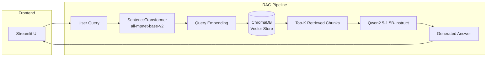

# 📚 RAG Book Chat — The Heart of a Woman

A production-ready **Retrieval-Augmented Generation (RAG)** chatbot built with Streamlit, ChromaDB, and Qwen2.5 LLM. This application enables natural language Q&A over the novel "The Heart of a Woman" by Baroness Orczy.

---

## 🏗️ Architecture



---

## ✨ Key Features

| Feature | Description |
|---------|-------------|
| **Semantic Search** | Vector similarity search using `all-mpnet-base-v2` embeddings |
| **Local LLM** | Runs entirely offline with Qwen2.5-1.5B-Instruct (~3GB) |
| **GPU Acceleration** | Automatic CUDA detection with FP16 inference |
| **Graceful Degradation** | Falls back to search-only mode if LLM fails to load |
| **ChatML Prompt Format** | Optimized prompts for instruction-tuned models |
| **Persistent Cache** | Streamlit caching for fast model reloads |

---

## 🛠️ Tech Stack

| Component | Technology | Purpose |
|-----------|------------|---------|
| **Frontend** | Streamlit | Interactive chat UI |
| **Embedding Model** | `all-mpnet-base-v2` | Text → Vector conversion |
| **Vector Database** | ChromaDB | Persistent similarity search |
| **LLM** | Qwen2.5-1.5B-Instruct | Answer generation |
| **ML Framework** | PyTorch + Transformers | Model inference |
| **Acceleration** | HuggingFace Accelerate | Automatic device mapping |

---

## 📁 Project Structure

```
Project_Nlp_Rag/
├── app.py                      # Main Streamlit application
├── chroma_db_optimized/        # Pre-built vector database
│   ├── chroma.sqlite3          # SQLite metadata store
│   └── *.bin                   # Embedding vectors
├── notebook/
│   ├── chuckstovec.ipynb       # Data preparation pipeline
│   └── datasets/
│       └── *.txt               # Source book text files
└── README.md
```

---

## 🚀 Quick Start

### Prerequisites

- **Python** 3.10+
- **GPU** (Recommended): NVIDIA with CUDA support
- **RAM**: 8GB minimum, 16GB recommended
- **VRAM**: 4GB+ for GPU inference

### Installation

```bash
# Clone the repository
git clone <repository-url>
cd Project_Nlp_Rag

# Install dependencies
pip install streamlit chromadb sentence-transformers transformers torch accelerate

# For Windows with CUDA (optional but recommended)
# Visit: https://pytorch.org/get-started/locally/
```

### Run the Application

```bash
streamlit run app.py
```

The app will be available at `http://localhost:8501`

> **First Run**: Models will be downloaded from HuggingFace Hub (~3.5GB total). This happens only once.

---

## ⚙️ Configuration

### Model Selection

Edit `app.py` line 45 to change the LLM:

```python
# Options (sorted by size):
model_name = "Qwen/Qwen2.5-0.5B-Instruct"    # ~1GB  - Fastest
model_name = "Qwen/Qwen2.5-1.5B-Instruct"    # ~3GB  - Balanced (default)
model_name = "Qwen/Qwen2.5-3B-Instruct"      # ~6GB  - Better quality
model_name = "mistralai/Mistral-7B-Instruct-v0.2"  # ~14GB - Best quality
```

### Generation Parameters

Customize response behavior in `app.py`:

```python
outputs = rag_pipeline(
    prompt,
    max_new_tokens=300,   # Max response length (increased for detailed answers)
    temperature=0.3,      # Lower = more focused, higher = more creative
    do_sample=True,       # Enable sampling
)
```

### Vector Search

Adjust retrieval in `get_rag_answer()`:

```python
results = db_collection.query(
    query_embeddings=query_embedding.tolist(),
    n_results=10  # Number of context chunks to retrieve
)
```

### Chunking Strategy

The vector database uses **RecursiveCharacterTextSplitter** with:

| Parameter | Value | Purpose |
|-----------|-------|---------|
| **chunk_size** | 500 chars | Optimal size for embedding model |
| **chunk_overlap** | 100 chars | Preserves context between chunks |
| **min_chunk_size** | 50 chars | Filters out tiny fragments |

---

## 📊 Performance

| Metric | Value |
|--------|-------|
| **Model Load Time** | ~10-15s (first run) |
| **Inference Latency** | ~1-3s per query (GPU) |
| **Memory Usage** | ~4GB VRAM |
| **Vector DB Size** | ~50MB |

---

## 🔧 Troubleshooting

### LLM Failed to Load

**Symptom**: `❌ โหลด LLM ไม่สำเร็จ`

**Solutions**:
1. Ensure sufficient VRAM/RAM
2. Try a smaller model (Qwen2.5-0.5B)
3. Check CUDA installation: `python -c "import torch; print(torch.cuda.is_available())"`

### ChromaDB Not Found

**Symptom**: `❌ ไม่พบโฟลเดอร์ ChromaDB`

**Solution**: Run the data preparation notebook:
```bash
cd notebook
jupyter notebook chuckstovec.ipynb
# Execute all cells to rebuild the vector database
```

### Slow Performance on CPU

**Solution**: Install CUDA-enabled PyTorch:
```bash
pip install torch --index-url https://download.pytorch.org/whl/cu124
```

---

## 🔮 Roadmap

- [ ] Multi-document support
- [ ] Streaming responses
- [ ] Conversation memory
- [ ] Thai language support
- [ ] Docker deployment
- [ ] API endpoint (FastAPI)

---

## 📄 License

MIT License — See [LICENSE](LICENSE) for details.

---

## 🙏 Acknowledgments

- **Baroness Orczy** — "The Heart of a Woman" (Public Domain)
- **Alibaba Cloud** — Qwen2.5 LLM
- **Sentence Transformers** — Embedding models
- **ChromaDB** — Vector database